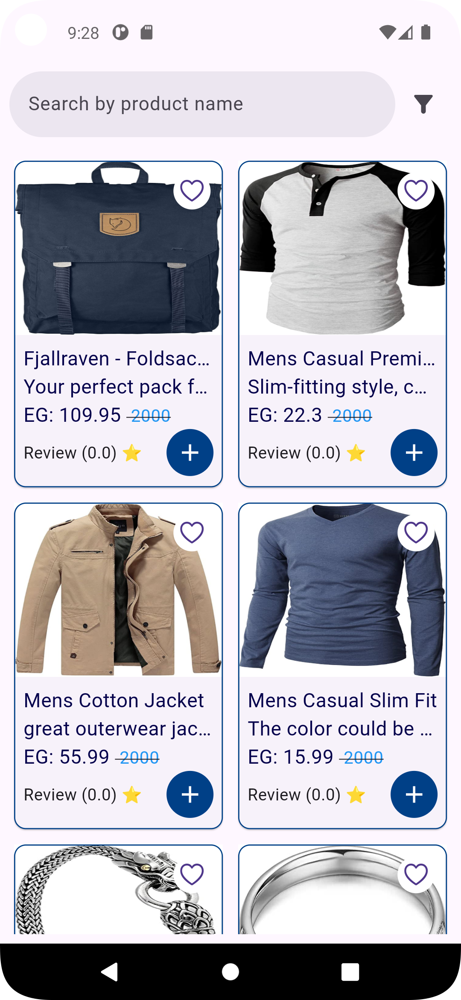
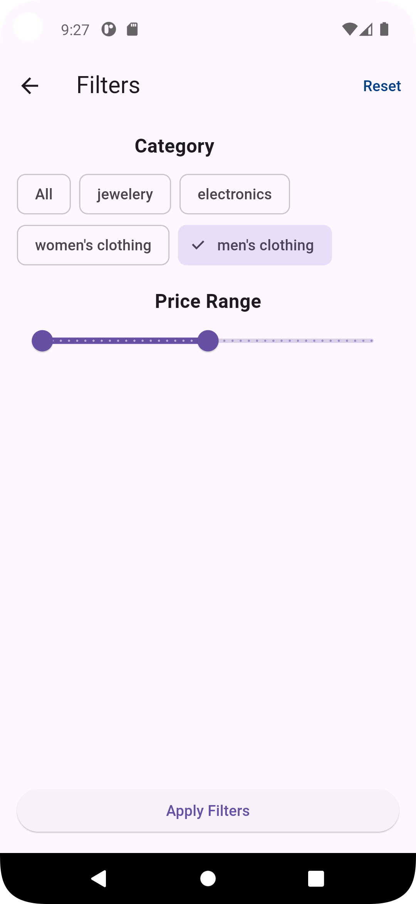
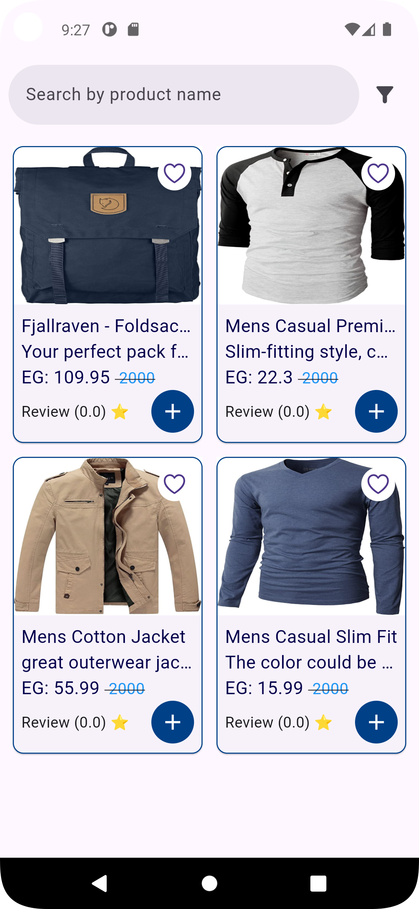

# elevate_task

A new Flutter project.

# Products App

An application that fetches products from an API and allows users to filter products by category.

## Features
- Fetch products from a remote API.
- Display a list of products with details.
- Filter products by category to enhance user experience.

## Design Screenshots

### Home Screen

### Filter by Category

### Filter by Category

## Getting Started

This project is a starting point for a Flutter application.

A few resources to get you started if this is your first Flutter project:

- [Lab: Write your first Flutter app](https://docs.flutter.dev/get-started/codelab)
- [Cookbook: Useful Flutter samples](https://docs.flutter.dev/cookbook)

For help getting started with Flutter development, view the
[online documentation](https://docs.flutter.dev/), which offers tutorials,
samples, guidance on mobile development, and a full API reference.
